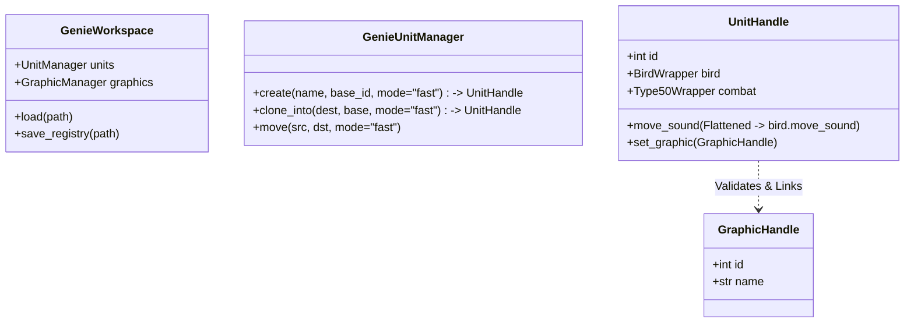

# AG_MIGRATION_PLAN

## 1. GOAL STATEMENT

**From**: A legacy/hybrid implementation that treats DAT files as lists of raw data.
**To**: A pure Object-Oriented Programming (OOP) library (`Actual_Tools_GDP`) that wraps `GenieDatParser` to provide a "Pythonic" interface.
**Core Philosophy**:
- **Wrappers**: Transform raw list-based data handling (GenieDatParser) into Class-based interactions.
- **Flatteners**: Provide easy, safe access to deeply nested attributes (e.g., `unit.move_sound` maps to `unit.bird.move_sound`).
- **Safety**: Inputs are strictly validated (Objects instead of Ints where possible) and invalid operations raise Exceptions immediately (No Rollback).

## 2. TOOLS & COMPONENTS INVENTORY

### GenieDatParser (Reference Source)
The library will wrap the following components found in `GenieDatParser/src`:

| Section | Files/Modules | Purpose |
|---------|---------------|---------|
| **Core** | `datfile.py`, `dat_header.py`, `dat_versions.py` | Root file handling and versioning. |
| **Civilization** | `civilization/`, `color_data/` | Civ management and colors. |
| **Units** | `unit_data/` | Core unit data, commands, and tasks. |
| **Techs** | `tech/`, `tech_effect/`, `tech_tree/` | Technologies, Effects, EffectCommands, and Tech Tree. |
| **Graphics** | `sprite_data/` | Sprites, frames, and resource graphics. |
| **Terrains** | `terrain_data/`, `terrain_table_data/` | Terrain headers, borders, passability, and terrain tables. |
| **Sounds** | `sounds/` | Sound files and items. |
| **Map** | `map_data/`, `swgb_data/` | Random map headers and definitions. |

### Actual_Tools_GDP Structure
| Folder | Responsibility |
|--------|----------------|
| `Base/` | `GenieWorkspace` (Entry Point). Handles loading/saving. |
| `Units/` | `UnitHandle`, `GenieUnitManager`. Wraps `unit_data`. |
| `Techs/` | `TechHandle`, `TechManager`. Wraps `tech` and `tech_effect`. |
| `Effects/` | `EffectHandle`. Wraps `tech_effect`. |
| `Graphics/` | `GraphicHandle`. Wraps `sprite_data`. |
| `Sounds/` | `SoundHandle`. Wraps `sounds`. |
| `Terrains/` | `TerrainHandle`, `TerrainManager`. Wraps `terrain_data` & `terrain_table_data`. |
| **Shared/** | `Registry` (ASP Link), `Logger`, `Exceptions`. |

## 3. API PURPOSE & VISION

- **OOP Transformation**: Users interact with Managers (e.g., `workspace.units`) to create/retrieve items, which return `UnitHandle` objects for manipulation.
- **ASP Integration**: A JSON Registry tracks created/modded items. This allows `AoE2ScenarioParser` (ASP) to reference items by "Handle ID" even if their internal DAT ID changes between game patches.
- **Versioning**: `GenieDatParser` handles all read/write versioning. `Actual_Tools_GDP` focuses on the Logic and API layer.

## 4. CORE ARCHITECTURE & PATTERNS

### Multi-Civ Propagation (Fast vs. Full)
Operations like `create`, `clone`, and `move` support two modes:
1.  **Fast Read (Default)**: Reads data *only* from the Gaia civilization (Civ 0) for speed. Writes are still propagated to **ALL** enabled civilizations.
2.  **Full Read**: Reads data from **ALL** civilizations (deep scan). Used when civs might have divergent data that needs to be preserved or analysed.

### Attribute Flattening & Safety
- **Mechanism**: `UnitHandle` delegates attribute access to sub-components (`bird`, `type_50`, etc.).
- **Safety**: To prevent typos creating garbage state (e.g. `unit.moove_sound = 1`), we will use an **Explicit Allow-List** or Slot-based system. Accessing an unknown attribute raises `AttributeError` immediately.

### Object-Based Validation
- **Rule**: Where possible, pass **Handles/Objects**, not raw Integers.
- **Why?**:
    - **Verification**: Prevents passing a Sound ID to a Graphic field.
    - **Dynamic Tracking**: If a Graphic is moved from ID 400 to 399, the Unit reference should update automatically if it holds the *Handle*.
- **Exception**: "Hidden" validation classes handle the final integer mapping during the write process.

## 5. FOLDER-BY-FOLDER MIGRATION PLAN

1.  **Shared/ & Base/**: Establish `GenieWorkspace`, `Registry`, and `Exceptions`.
2.  **Simple Assets (Sounds/Graphics/Terrains)**: Implement Handles to support "Object-Based Validation" for Units.
3.  **Units/**: Implement `UnitHandle` with:
    -   Flattening allow-list.
    -   Fast/Full read modes in `UnitManager`.
    -   Sub-wrappers (`BirdWrapper`, `CombatWrapper`).
4.  **Techs/ & Effects/**: Implement Handles with cross-referencing.
5.  **Integration**: Ensure `Registry` correctly exports the JSON map for ASP.

## 6. EXPECTED CLASS HIERARCHY



## 7. USAGE EXAMPLES

### Creation & Flattening
```python
# Create with "Overwrite" conflict resolution
unit1 = workspace.units.create(
    name="Hero1",
    base_unit_id=4,
    unit_id=2900,
    on_conflict="overwrite"
)

# Deep Access (OOP Style)
unit1.bird.move_sound = 1 

# Flattened Access (Safe & Convenient)
unit1.move_sound = 20  # Updates unit1.bird.move_sound
# unit1.moove_sound = 20  # raises AttributeError (Safety)

# Sub-object wrapper usage
unit1.creatable.train_location_id = 1
```

### Modes & Managers
```python
# Move with Fast Read (Default - reads Gaia source)
workspace.units.move(src_unit_id=100, dst_unit_id=1501)

# Clone with Full Read (Reads all civs to preserve unique stats)
workspace.units.clone_into(
    dest_unit_id=1500, 
    base_unit_id=4, 
    mode="full"
)
```

### Object-Based Validation
```python
# Fetch a graphic handle
arrow_graphic = workspace.graphics.get(500)

# Pass the HANDLE, not the ID (500)
# Library validates it's a Graphic, not a Sound
unit1.projectile.graphic = arrow_graphic 
```

## 8. BEHAVIORAL SPECIFICATIONS

### Validation & Errors
- **No Rollback**: If an error occurs (e.g., Invalid ID, Type Mismatch), the operation aborts immediately with an Exception. The state is left as-is (partially modified if halfway through, but atomic ops preferred).
- **Type Checking**: Passing `SoundHandle` to `unit.graphic` raises `TypeError`.

### ASP Registry
- Every `create`, `clone`, or `move` operation updates the internal `Registry`.
- `workspace.save_registry("genie_edits.json")` exports the map.
- **Workflow**:
    1.  User runs Script -> Generates `mod.dat` + `genie_edits.json`.
    2.  ASP reads `genie_edits.json` to know that "Hero1" is at ID 2900.
